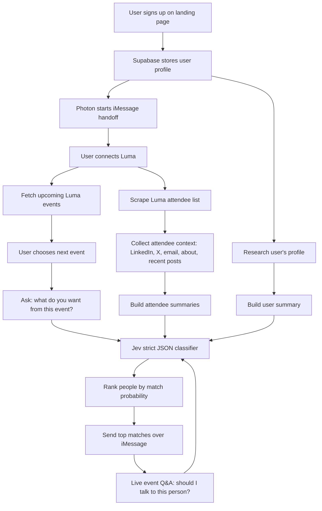

# Meety

Meety is an iMessage networking agent for Luma events. It helps an attendee figure out who to meet before and during an event by combining the attendee's profile, their event-specific goal, and the public/social context of other attendees.

Built for the **TypeSafe AI x AI Collective: Jev Hackathon** in San Francisco.

## Hackathon Brief

**Event:** JEVATHON - Jev Hackathon SF  
**Host venue:** CodeRabbit HQ, San Francisco, CA  
**Date:** Saturday, September 26, 2026  
**Build window:** 11:30 AM-2:30 PM  
**Demo window:** 2:30-3:30 PM  
**Theme:** build with Jev, move fast, think in systems, and ship working code that could survive outside the room.

The Notion brief is explicit: the goal is not polished slides. The goal is a working proof of concept built with Jev and presented to technical judges.

## The Problem

Networking at events is usually random. You register for a Luma event, show up, scan a room full of strangers, and hope you happen to talk to the right person before the event ends.

Meety turns that into a guided workflow:

- sign up once
- connect your Luma account
- tell Meety what you want from this specific event
- get matched with the highest-signal people before the event
- ask live questions over iMessage while you are in the room

The key difference from generic profile matching is that Meety does not only ask, "are these two people similar?" It asks, "given this attendee's current goal for this exact event, is this other person worth meeting?"

## Hackathon Fit

The hackathon asks teams to build working products with Jev and present live prototypes to technical and product judges. The Notion page says projects are evaluated across **five core dimensions**, with judges scoring each category independently before discussing the overall ranking.

For the main track, projects must be built with Jev. Partner tools qualify projects for sponsor awards.

Meety is designed around the hackathon's judging direction:

| Criterion | How Meety addresses it |
|---|---|
| Built with Jev | Jev is the core match classifier. It makes the yes/no/probability decisions that determine who the user should meet. |
| Working prototype | The product can be demoed as a real iMessage flow, not just described in slides. |
| Technical architecture | The repo is split into clear lanes: iMessage, Luma access, research, Jev matching, and sign-up/storage. |
| Originality | The product is an at-event personal networking agent, not another generic chatbot, CRM, or static profile matcher. |
| Anti-slop | The UX is intentionally minimal: no dashboard bloat, no vague AI magic, just timely text messages with concrete recommendations. |

## Workflow



## Where Jev Fits

Jev is the decision layer, not just a side API call.

For each possible match, Meety sends Jev a structured classification task with:

- the user's profile summary
- the user's goal for the event
- the event context
- the other attendee's account data, recent posts, bio/about text, LinkedIn/X signals, and email-derived context when available
- a strict response schema

Expected Jev output:

```json
{
  "match": true,
  "probability": 0.82,
  "reason": "The attendee is an AI infrastructure investor and the user wants to meet investors for an agent platform.",
  "best_conversation_starter": "Ask about what infra bottlenecks they are seeing in agent startups.",
  "confidence": "high"
}
```

Meety uses this output in two places:

1. **Pre-event ranking:** run Jev across the attendee list and send the top matches before the event.
2. **Live iMessage Q&A:** when the user texts "I'm talking to Carlos, should I pitch him?", Jev returns a yes/no/probability answer with a short reason.

The conversation brain can be a cheaper LLM or deterministic state machine, but Jev owns the match judgment.

## Tool Stack

| Tool | Role |
|---|---|
| **Jev / TypeSafe AI** | Core hackathon platform and the classifier for match/no-match decisions, probabilities, reasons, and conversation starters. |
| **Photon** | Messaging layer for iMessage onboarding, reminders, match delivery, and live Q&A. |
| **Supabase** | Sign-up, user records, session state, and persisted event/match data. |
| **Luma** | Source of upcoming events and attendee lists. |
| **LinkedIn / X** | Profile and recent activity signals for users and attendees. |
| **Tavily / web research** | Background enrichment for user and attendee summaries. |
| **Browserbase / browser automation** | User-authorized Luma access and attendee-list scraping where the event exposes the list. |
| **HackerSquad** | Hackathon submission and judging platform. |
| **CodeRabbit** | Code review and coding-agent resource during the sprint. |
| **GMI Cloud** | Optional inference/GPU platform for richer profile processing or multimodal extensions. |
| **ElevenLabs** | Optional voice support if we turn voice-note goals into transcript text. |
| **LlamaIndex** | Optional indexing/RAG layer if attendee research needs retrieval over larger context. |

## Partner Tool Alignment

The Notion resource table names these partner tools and categories:

| Partner | Notion role/category | Meety usage |
|---|---|---|
| Jev / TypeSafe AI | Core build platform for JEVATHON | Primary decision engine for strict JSON match classification. |
| Photon | Messaging, AI agents, open source | User-facing iMessage agent. |
| Browserbase | Browser automation, AI infrastructure | User-authorized Luma access and attendee-list extraction. |
| HackerSquad | Submissions | Team registration, project submission, and judging. |
| CodeRabbit | AI code review, developer tools | Code quality and review support during the sprint. |
| GMI Cloud | Cloud compute, AI inference | Optional model/inference layer for enrichment. |
| ElevenLabs | Voice AI, GenAI | Optional voice note transcription/speech expansion. |
| LlamaIndex | RAG, AI agents, open source | Optional structured retrieval over research summaries. |
| Whop | Commerce, developer tools | Not core to this MVP. |
| Cognition | AI agents, IDE, developer tools | Inspiration/judge ecosystem; not core to this MVP. |

## User Flow

1. User signs up on the landing page.
2. Supabase stores the user's phone number, name, email, LinkedIn, and optional X.
3. Photon texts the user in iMessage.
4. User connects Luma through an authorized browser flow.
5. Meety finds the user's next Luma event.
6. Meety asks what the user wants from that event.
7. Meety researches the user and the visible attendees.
8. Jev classifies each attendee against the user's event goal.
9. Meety sends the best matches over iMessage.
10. During the event, the user can text Meety about any person they meet.

## Example iMessage Experience

```text
Meety:
you're down for Agents Night SF tomorrow at 6:30 PM. want me to prep you for that one?

User:
yes

Meety:
what do you want to get out of Agents Night SF?

User:
i want to meet investors and people building agent infrastructure

Meety:
here's who i'd find:

1. Sherry Liu
82% match. Seed investor focused on AI infrastructure and devtools.
ask her what agent infra bottlenecks she's seeing in portfolio companies.

2. Nina Kowalski
74% match. ML researcher working on evals and model routing.
ask how she evaluates agent reliability in production.
```

## Repo Structure

| Folder | Owner(s) | Purpose |
|---|---|---|
| [`photon-imessage`](photon-imessage/) | Gab | iMessage onboarding, reminders, live Q&A, and internal HTTP handoff endpoints. |
| [`browserbase-luma`](browserbase-luma/) | Jozi | Luma login/session flow and attendee-list extraction. |
| [`landing-page`](landing-page/) | Carlos | Minimal sign-up page and Supabase entry point. |
| [`tavily-research`](tavily-research/) | Martin | User and attendee profile enrichment. |
| [`jev-integration`](jev-integration/) | Martin, Carlos, Shrey | Strict JSON Jev prompts and match classification. |

Meeting context:

- [`granola.md`](granola.md) - original meeting-context export
- [`ADDENDUM.md`](ADDENDUM.md) - transcript corrections and extra details

## Current Prototype

The most complete lane is [`photon-imessage`](photon-imessage/). It includes:

- a conversation state machine
- local terminal chat mode
- Photon/iMessage transport
- internal `/handoff`, `/notify`, and `/health` endpoints
- stub services for Luma, research, matching, and transcription
- tests for the onboarding and live Q&A flow

Run locally:

```bash
cd photon-imessage
npm install
npm test
npm run chat
```

For real iMessage:

```bash
cd photon-imessage
SPECTRUM_PROJECT_ID=...
SPECTRUM_PROJECT_SECRET=...
npm start
```

## Demo Plan

The live demo should show the product working end to end:

1. User signs up.
2. Meety texts them through Photon/iMessage.
3. User connects Luma.
4. User gives an event goal.
5. Meety pulls attendee context.
6. Jev returns strict JSON match decisions.
7. Meety sends ranked matches.
8. User asks a live question about a person at the event.
9. Meety answers with a Jev-backed yes/no/probability judgment.

## Submission Checklist

The Notion page says submissions and judging are powered by HackerSquad.

- Register the team on HackerSquad.
- Submit the project under `./project.sh`.
- Give sponsor/tool feedback under `./tools+feedback.sh` for the extra-prize track.
- Submit before the 2:30 PM hard stop.
- Be ready for live judging between 2:30 and 3:30 PM.

## Known Constraints

- Some Luma events hide attendee lists. Meety should gracefully switch to live Q&A mode when no list is visible.
- LinkedIn data is access-constrained, so the MVP should accept user-provided links and enrich what is legally reachable.
- The iMessage prototype currently uses in-memory state; production should persist sessions in Supabase.
- Voice notes are part of the intended UX, but the transcription provider is not finalized.
- Jev prompts should stay deterministic and schema-bound. The agent should not invent arbitrary Jev prompts at runtime.

## Why This Should Win

Meety puts Jev in the center of a real-time decision workflow. It is not using Jev as decoration; Jev is the classifier that turns messy social context into a useful action: "talk to this person" or "skip this one."

The result is a small, personal agent that solves a problem every hackathon attendee understands while showing a clean architecture across messaging, event data, research, and typed classification.
